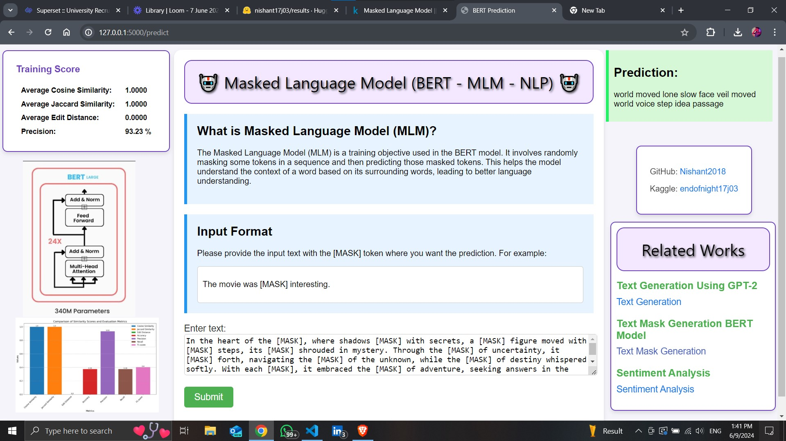

---

# Masked Language Model (BERT - MLM - NLP)

🤖 This project demonstrates the use of a Masked Language Model (MLM) with BERT for predicting masked tokens in a given text. The model is trained to understand the context of words based on their surrounding words, leading to better language understanding.



## Table of Contents
- [Introduction](#introduction)
- [Features](#features)
- [Getting Started](#getting-started)
  - [Prerequisites](#prerequisites)
  - [Installation](#installation)
  - [Running the App](#running-the-app)
- [Usage](#usage)
- [Example](#example)
- [Related Works](#related-works)
- [Contributing](#contributing)
- [License](#license)

## Introduction
The Masked Language Model (MLM) is a training objective used in the BERT model. It involves randomly masking some tokens in a sequence and then predicting those masked tokens. This helps the model understand the context of a word based on its surrounding words, leading to better language understanding.

## Features
- Predict masked tokens in a sentence using BERT.
- Display training scores including Average Cosine Similarity, Average Jaccard Similarity, Average Edit Distance, and Precision.
- Provide related works for further exploration.

## Getting Started

### Prerequisites
- Python 3.6 or higher
- pip (Python package installer)
- Git (for cloning the repository)

### Installation
1. Clone the repository:
    ```bash
    git clone https://github.com/Nishant2018/Masked-Language-Model-BERT.git
    cd bert-mlm-nlp
    ```

2. Create and activate a virtual environment (optional but recommended):
    ```bash
    python -m venv venv
    source venv/bin/activate  # On Windows use `venv\Scripts\activate`
    ```

3. Install the required packages:
    ```bash
    pip install -r requirements.txt
    ```

### Running the App
1. Start the Flask web application:
   ```bash
    Before starting the flask app verify the BERT Model path. Before using the model extract from zip then pass that path in your flask code.
    ```
2. Start the Flask web application:
    ```bash
    export FLASK_APP=app.py
    export FLASK_ENV=development  # This enables debug mode
    flask run
    ```
    On Windows, use `set` instead of `export`:
    ```bash
    set FLASK_APP=app.py
    set FLASK_ENV=development
    flask run
    ```

2. Open your web browser and navigate to `http://127.0.0.1:5000`.

## Usage
1. Enter a sentence with `[MASK]` tokens where you want the prediction.
2. Click on the "Submit" button to get the prediction.
3. View the results on the page.

## Example
```text
The [MASK] quickly jumped over the [MASK] and ran into the [MASK], startling the [MASK] nearby.
```

### Larger Example:
```text
The [MASK] sky was filled with [MASK] as the [MASK] festival began. Children ran around with [MASK] in their hands, while adults enjoyed the [MASK] food and music. The evening [MASK] was a [MASK] display of fireworks that lit up the [MASK] night.
```

## Related Works
- [Text Generation Using GPT-2](https://www.kaggle.com/code/endofnight17j03/textgeneration-transformers-gpt-2)
- [Text Mask Generation BERT Model](https://www.kaggle.com/code/endofnight17j03/text-mask-generation-googlebert-llm)
- [Sentiment Analysis](https://www.kaggle.com/code/endofnight17j03/imdb-movies-nlp-sentiment-analysis)

## Contributing
1. Fork the repository.
2. Create a new branch (`git checkout -b feature-branch`).
3. Make your changes.
4. Commit your changes (`git commit -am 'Add new feature'`).
5. Push to the branch (`git push origin feature-branch`).
6. Create a new Pull Request.

## License
This project is licensed under the MIT License - see the [LICENSE](LICENSE) file for details.

---
